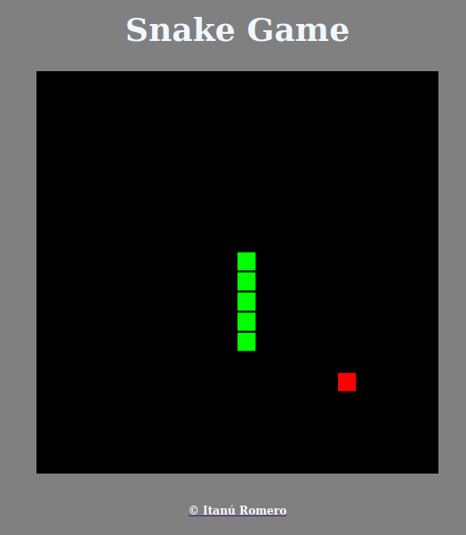

# SnakeGame on JavaScript

I was in the YouTube and see a video where a guy code ["snake game" in 4min30s](https://www.youtube.com/watch?v=xGmXxpIj6vs)!!!
My reaction, obviously, was:

_I need to try it!!_

Then, this is the result: 

Check how I made it on the files above, or [play clicking here](https://itanuromero.github.io/SnakeGame/) 
> PS: Game only available for PC.
